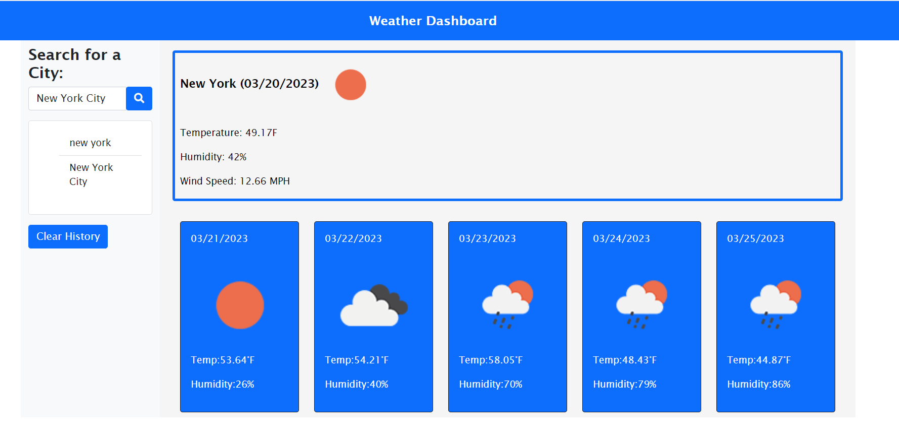

# Weather-Dashboard

## Description

A weather application that will allow user to input a location, click search, and get a 5 day forcast of the desired location showing the date, tempreature, and humidity.

## Coding Tools Used 

* HTML
* CSS
* Bootstrap
* jQuery
* Javascript
* dayJS
* OpenWeatherAPI

## Wesbite Preview

### <ins>[Weather Dashboard](https://soumpholphakdy.github.io/Weather-Dashboard/)</ins>

 

